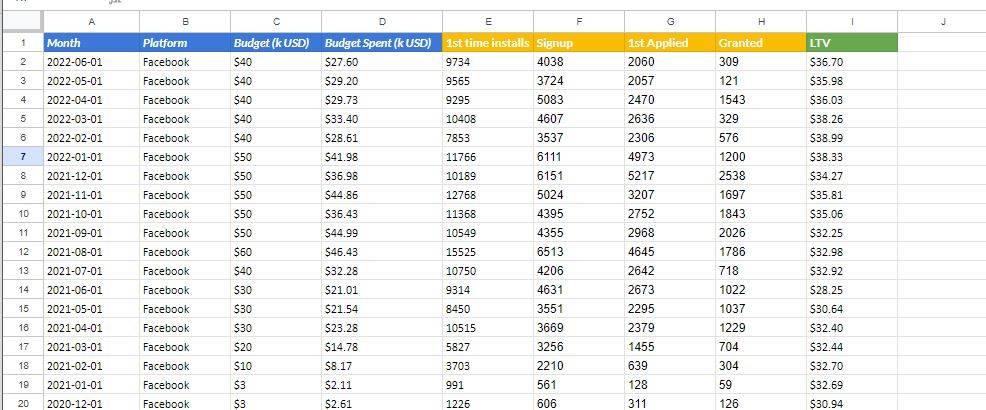
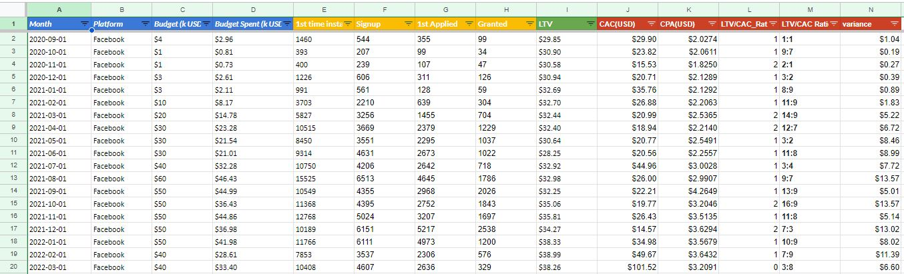
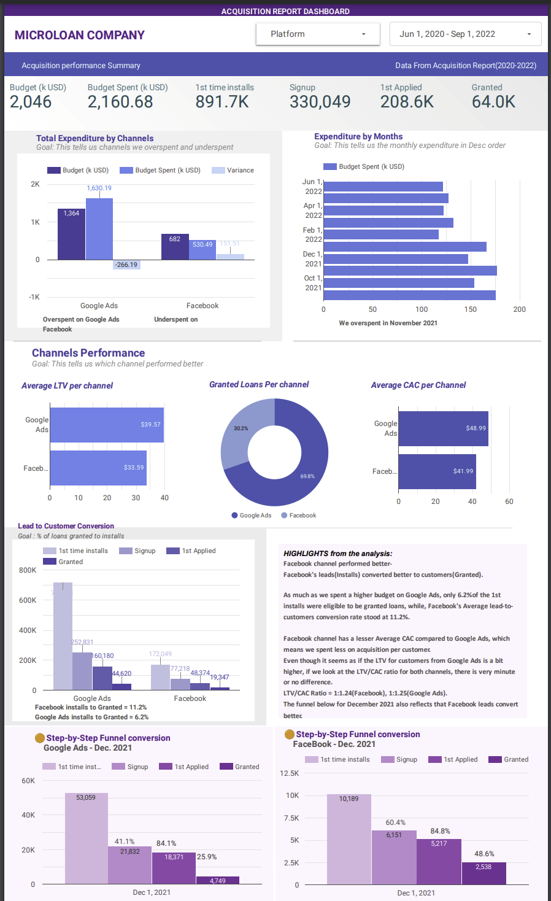

# User-Acquisition-Report-for-Microloan-Company

## Introduction

#### About The Micro-loan company
The company is Fintech Startup with the mission of becoming the one-stop platform for micro-entrepreneurs and small business owners to solve their financial needs. Branchless. Responsible. The Company leverages artificial intelligence to build an app-based product that has been downloaded by more than 2.5 Million people. It has processed over 5 Million micro-credit applications. A Dream Team of 120+ people, from multiple locations around the world, hustling everyday to make our crazy vision a reality - and won’t rest until our app is used everyday by millions of entrepreneurs!

## Problem Statement
As the Growth Hacker and consultant for one of the primary products - micro loan, in addition to other Growth Hackers for other products, the company checks acquisition performance on a weekly and monthly basis. Given the acquisition report from 2020 to 2022,I did proper analysis to answer the following questions.

- Which channel are we overspending? And underspending.
- When did we overspend?
- Which channel is performing better?
- What is the funnel conversion for a given month on a platform? For example, step by step funnel conversion for December 2021, by channel.

## Analytical Tools Used
- Google Sheets
- Google Data Studio

## Data Source
Find the Data set here

[https://docs.google.com/spreadsheets/d/1gTEgjbcxGMdB1LsOgjzQwjJlZhUQ427BoacZ2jp-yAc/edit#gid=0]

I added the data that was shared by the company through the "add data" tab on Google Data Studio using Google sheets connector.

It contains one sheet and columns like Months,Platform,Budgets,installs,Signups,LTV. 

## Data Modelling,Transformation and Cleaning
Data was efficiently cleaned and transformed on Google sheet.

Find the transformed data set here

[https://docs.google.com/spreadsheets/d/1kPcYThnuk_wLOHE22LQ9vyXhNxu-auQTqWJpW_YE_UU/edit#gid=0]

See image below

#### Some of the applied steps included
Creating extra columns for metrics that helped me with assessing performance of the acquisition channels. The new columns that i created were to calculate parameters like;
- The CAC(cost of acquisition) = [Budget spent/No. of Loans granted] * 1000
- CPA(Cost per acquisition) =  [Budget spent/First time Installs] * 1000
- LTV/CAC Ratio 
- Variance = Budget - [Budget spent]
That helped me in the analysis

I also added fields to the data by the use of calculated formulas on data studio ,this helped in my funnel analysis,
Fields i added were
- Installs to Signup
- Signup to Applied
- Applied to Granted
They were in percentages and i was able to do the funnel analysis with the fields

## Data Visualization and Analysis
The dashboard was done on Google Data Studio
With all the data points, I created a dashboard with a set of visualization charts that helped company stakeholders get the answers to the problem statements easily

#### Which channel are we overspending? And underspending.
- ANS: As Visualized in the "Total Expenditures by channels" graph, We overspent on Google Ads. Not just spending a lot, we overshoot the budget.

#### When did we overspend?
- ANS: We overspent in November 2021 as shown in the "Expenditures by Month" Graph, with a total expenditure of 177k dollars being the highest spending.
From the Graph below, we could also see the variance between budget and expenditure being the highest, which means we overshoot the budget too in that month.

#### Which channel is performing better?
- ANS:  As shown in the "Channel Performance " section of the dashboard, Facebook channel performed better-
Facebook's leads(Installs) converted better to customers(Granted).

As much as we spent a higher budget on Google Ads, only 6.2% of the 1st installs were eligible to be granted loans, while, Facebook's Average lead-to-customers conversion rate stood at 11.2%.

The Facebook channel has a lesser Average CAC compared to Google Ads, which means we spent less on acquisition per customer.
Even though it seems as if the LTV for customers from Google Ads is a bit higher, if we look at the LTV/CAC ratio for both channels, there is very minute or no difference.
LTV/CAC Ratio = 1:1.24(Facebook), 1:1.25(Google Ads).
The funnel for December 2021 also reflects that Facebook leads convert better.

#### What is the funnel conversion for a given month on a platform? For example, step-by-step funnel conversion for December 2021, by channel.
- ANS: Funnel conversion for Dec 2021 is shown in the graph on the dashboard

### Conlusion and Recommendation)

Looking at the charts created, the following questions were answered

#### Why do you think one channel performs better than the other one?
Looking at the conversion rate, we could see that even when we didn't get the number of leads on Facebook as we got on Google, Facebook gave us more conversions, which could imply that ;
- 1. We acquired better leads by reaching the right audience.
- 2. The types of Ads we placed on Facebook were more effective
and also we reached better demographics than Google ads, even with a lower budget. and expenditure.

### What could be the reason for CTR in an acquisition channel to drop?
A drop in an acquisition channel may be an indicator that;
1. The copy or headline isn’t effective or
2. that we are targeting the wrong audience or
3. we are reaching the wrong demographics or
4. We are spending money on the wrong keywords.
What could be the reason for LTV in an acquisition channel to drop? List all you can think of and the additional data you’d request to investigate this;
1. Wrong target audience could cause it, Poor customer relationship management on the channel, Poor Brand image of the company on the channel - Analyse channel engagements(clicks, likes, comments)
2. The customer didn't get the value of what was displayed in the ad.
Wrong advertising strategy in the acquisition method could cause a drop in LTV as customers might respond differently to the information.
3. Changes in the needs and expectations of customers changing could cause a drop in LTV. We shouldn't fail to recognise that the customer base continually shifts and evolves.- Ads on a particular channel should be dynamic.
and match up with trends and also study what competitors are doing to retain their users
4. The kind of ads that brought the customer in could be analysed to see why they churn. Might be that some customers came because of a referral campaign and after that, they dropped.
